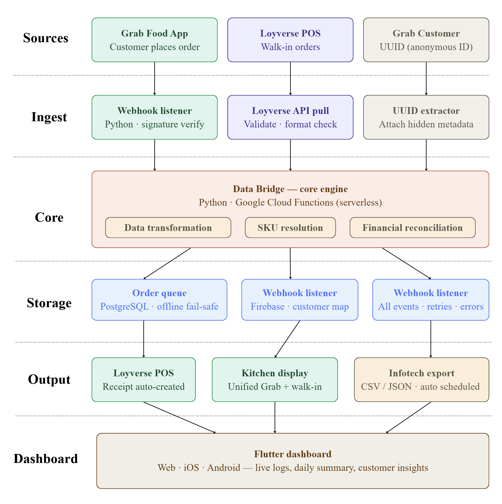
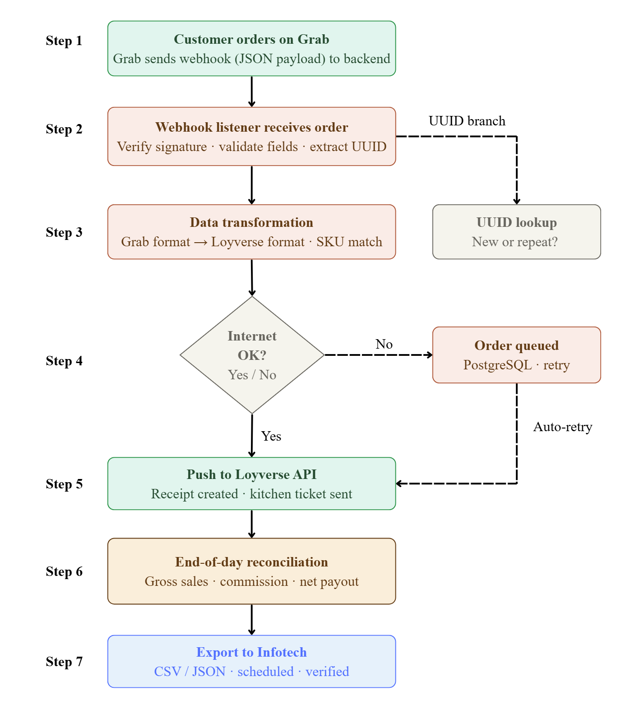
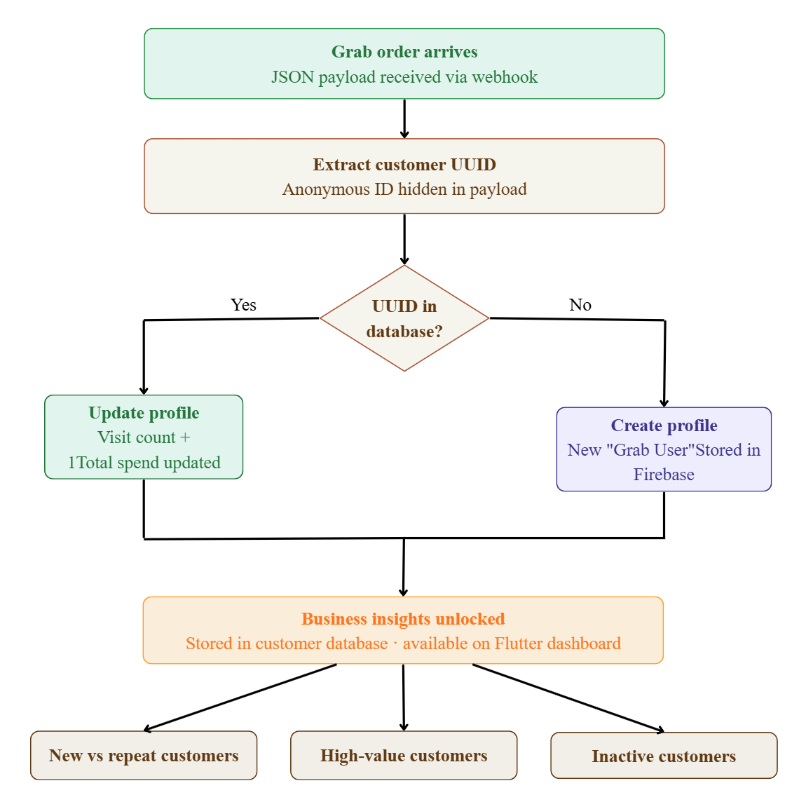

# The Data Bridge
### A Centralized Data Management & Reconciliation System
**Grab × Loyverse POS × Infotech Accounting**

> *Orders flow. Customers are known. Accounts close themselves.*

---

## The Problem

A business running on multiple platforms — Grab Food, Loyverse POS, and Infotech — faces three critical bottlenecks:

| Problem | Impact |
|---|---|
| Loyverse gross sales never match Grab net payouts | Finance team cannot determine true profit |
| Grab masks customer phone numbers | Impossible to identify loyal or repeat buyers |
| No automated data transfer between systems | Staff spend hours on manual reconciliation daily |

---

## Our Solution

The **Data Bridge** is a custom event-driven middleware that sits between all three platforms and acts as a **Single Source of Truth (SSOT)**.

It ingests Grab orders in real time, translates them into Loyverse format, tracks customers using anonymous UUIDs, reconciles financials automatically, and exports a verified daily ledger to Infotech — with **zero staff intervention**.

---

## System Architecture

*Screenshot of the full system architecture diagram showing all layers — data sources, ingestion, core engine, storage, output, and Flutter dashboard.*

---

## Workflow — What Happens to Every Order

*Step-by-step data flow: from Grab order placement through webhook ingestion, transformation, offline queue failsafe, POS push, end-of-day reconciliation, and Infotech export.*

---

## Customer Intelligence — Solving the UUID Problem

Grab hides all customer phone numbers for privacy compliance. Our system works around this using **Grab Customer UUIDs** — anonymous alphanumeric identifiers included in every order payload.

*UUID lookup logic: new customers get a profile created automatically, returning customers get their visit count and spend updated — all without accessing restricted phone number data.*

The result unlocks three business insights previously unavailable:
- **New vs Repeat customers** — tracked across both delivery and walk-in channels
- **High-value customers** — automatically ranked by cumulative spend
- **Inactive customers** — identified for re-engagement campaigns (30+ days without an order)

---

## Tech Stack

| Layer | Technology | Purpose |
|---|---|---|
| Backend / Webhook | Python + Google Cloud Functions | Serverless event processing |
| Order Queue | PostgreSQL | Offline fail-safe storage |
| Customer Database | Firebase | UUID mapping + profile store |
| POS Integration | Loyverse API | Receipt creation, item sync |
| Delivery Integration | Grab Merchant API | Webhook ingestion |
| Accounting Export | CSV / JSON | Infotech-compatible format |
| Dashboard | Flutter (Web / iOS / Android) | Owner-facing control panel |

---

## Key Design Decisions

### Offline-resilient queue
Internet connections fail — especially during peak lunch hours. Every order that cannot be pushed immediately is stored in a local PostgreSQL queue and automatically retried when connectivity restores. No orders are ever lost.

### UUID-based customer tracking
Grab's privacy policy prohibits sharing customer phone numbers. Rather than treating this as a limitation, the system uses the anonymous UUID Grab provides in every payload to build persistent customer profiles — fully compliant, fully functional.

### Zero staff training required
The Data Bridge operates entirely at the middleware layer. Cashiers continue using Loyverse exactly as before. Kitchen staff see one unified screen. Nothing in the front-of-house workflow changes. The system is invisible to the people it serves.

### Mathematically verified financials
The reconciliation layer does not estimate or approximate. It compares every Grab settlement line against every generated Loyverse receipt, applies the exact commission percentage, and flags any discrepancy for review before export. Accounting receives numbers it can trust.

---

## Live Prototype

A working demonstration of the core workflow — real-time order sync, unified kitchen display, and automated financial reconciliation — built using **Google Sheets + Apps Script** to simulate the middleware layer.

**[▶ Launch Live Demo](https://script.google.com/macros/s/AKfycbzSFasZkuwxpValKgDpgm4BIJ3k1T2J3QiV7PNvNYXuZCQJELg5qVcYi3kuimnL22s0/exec)**

Click any button in the demo — no login, no typing required. The demo simulates:
- `▶ New Grab Order` — webhook triggers, order syncs to kitchen in under 3 seconds
- `🧾 New Walk-In` — POS order pushed to unified kitchen view
- `🍳 Update Kitchen Status` — cycles order through New → Preparing → Completed
- `📊 Close Day` — auto-generates financial summary with Grab commission breakdown
- `🔄 New Day Reset` — clears active sheets, preserves all history

---

## Expected Impact

| Area | Before | After |
|---|---|---|
| Order entry | Manual re-typing per order | Fully automatic, under 3 seconds |
| Kitchen visibility | Grab tablet + POS separate | One unified screen |
| Daily reconciliation | 30–60 min manual work | Zero — auto-generated |
| Customer tracking | Not possible | UUID-based profiles built automatically |
| Accounting export | Manual data transfer | Scheduled, verified, automatic |
| Error risk | High — human copy-paste | Zero — system-verified math |

---

## Why This Works

Most integration solutions are built for ideal conditions. This one is built for reality.

Three hard truths about retail technology shaped every architectural decision:

**Internet connections fail.** The order queue ensures no transaction is lost — orders hold locally and sync the moment connectivity returns.

**Data privacy is non-negotiable.** UUID tracking builds full customer intelligence without ever accessing or storing restricted personal data.

**Staff resist change.** Nothing in the frontline workflow has changed. The Data Bridge does all the heavy lifting invisibly, in the background.

The result is a system that is resilient by design, compliant by default, and ready for production from day one — with zero retraining, zero disruption, and zero tolerance for data loss.

---

## Project Timeline

| Phase | Timeline | Deliverable |
|---|---|---|
| Phase 1 | Apr 2026 | Webhook listener + data transformation |
| Phase 2 | May 2026 | UUID tracking + customer database |
| Phase 3 | Jun 2026 | Financial reconciliation + Infotech export |
| Phase 4 | Jun 2026 | Flutter dashboard + full system testing |

*Estimated project start: Apr–Jun 2026 (subject to change)*

---

## Authors

| Name | Role |
|---|---|
| Lim Huey Wen | Co-developer |
| Noel Lim | Co-developer |

---

## Submitted For

**DXP Challenge 2026**
Deadline: 19 March 2026, 6PM
Submission: [https://forms.gle/ad4Yt8Y36rqBwFFL9](https://forms.gle/ad4Yt8Y36rqBwFFL9)
